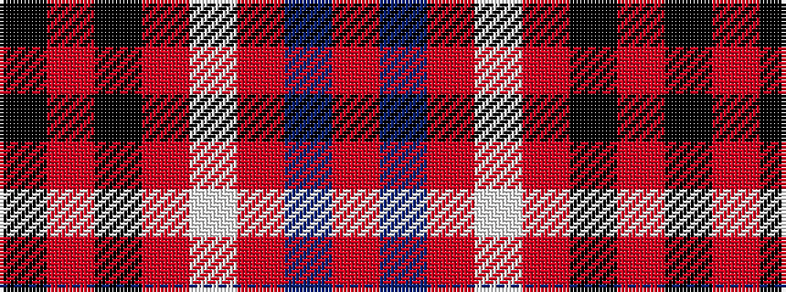

KRKRWRBR

It is a 8 stripe tartan.

<figure class="pat-woven">

<figcaption>idealised sample</figcaption>
</figure>

## Colour Sequence



## Tartans with this colour sequence

| Tartans |
|---------------|
| [Whitaker (2014)](/setts/s8/k60r3k15r3lb2r5b3r2~x2/)|
||
| [Whitaker (2014)](/setts/s8/k60r3k15r3lb2r5db3r2~x2/)|
||
