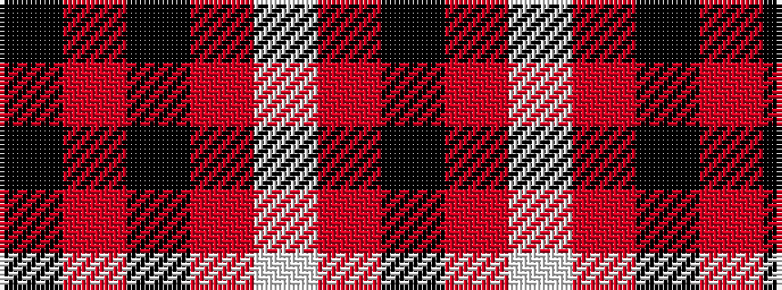

KRKRWRK

It is a 7 stripe tartan.

<figure class="pat-woven">

<figcaption>idealised sample</figcaption>
</figure>

## Colour Sequence



## Tartans with this colour sequence

| Tartans |
|---------------|
| [Gleneagles](/setts/s7/k4o4w35o1k36o4k2~x2/)|
||
