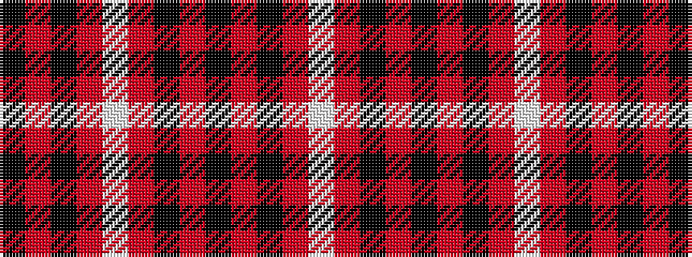

KRKRWRKRKRKRW

It is a 13 stripe tartan.

<figure class="pat-woven">

<figcaption>idealised sample</figcaption>
</figure>

## Colour Sequence



## Tartans with this colour sequence

| Tartans |
|---------------|
| [Westwood MacBrick (Fashion)](/variants/s13/k11r2k11r20w2r20k7r1k7r1k7r11w1~x2/)|
||
| [Westwood MacRock (Fashion)](/variants/s13/k11o2k11o20w2o20k7o1k7o1k7o11w1~x2/)|
||
