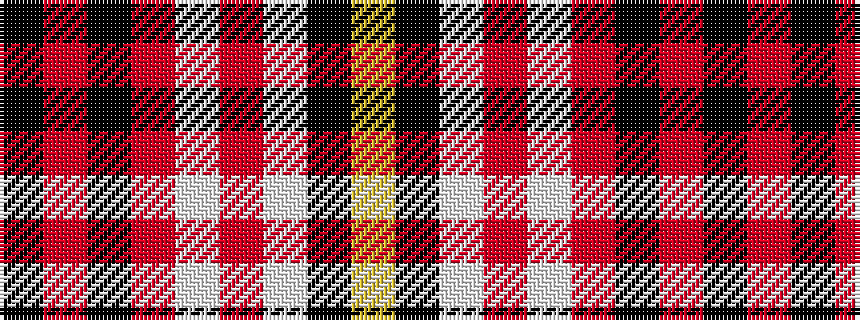

KRKRWRWKY

It is a 9 stripe tartan.

<figure class="pat-woven">

<figcaption>idealised sample</figcaption>
</figure>

## Colour Sequence



## Tartans with this colour sequence

| Tartans |
|---------------|
| [O'Meehan (Name)](/setts/s9/ly27k4w4r64w4r4k4r4k12~x2/)|
||
