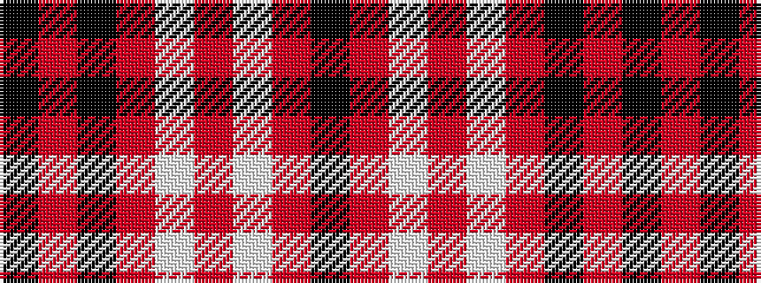

KRKRWRWRK

It is a 9 stripe tartan.

<figure class="pat-woven">

<figcaption>idealised sample</figcaption>
</figure>

## Colour Sequence



## Tartans with this colour sequence

| Tartans |
|---------------|
| [Tweedside](/setts/s9/k18r2k2r5w2r2w2r2k2~x2/)|
||
| [Tweedside Red](/setts/s9/k18r2k2r5w2r2w2r2k2~x4/)|
||
