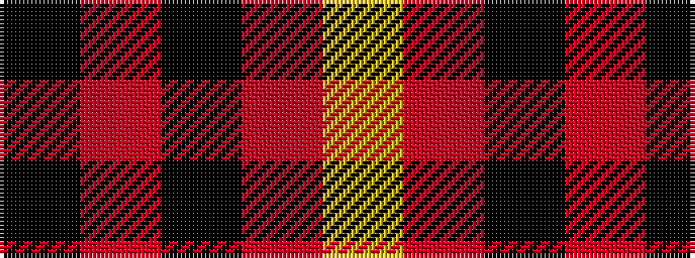

KRKRY

It is a 5 stripe tartan.

<figure class="pat-woven">

<figcaption>idealised sample</figcaption>
</figure>

## Colour Sequence



## Tartans with this colour sequence

| Tartans |
|---------------|
| [Munro VS](/setts/s5/k18r4k18r32lr3~x2/)|
||
| [Munro VS](/setts/s5/k18r4k18r32lr3/)|
||
