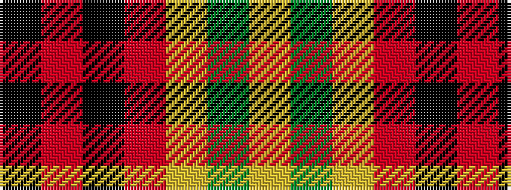

KRKRYGY

It is a 7 stripe tartan.

<figure class="pat-woven">

<figcaption>idealised sample</figcaption>
</figure>

## Colour Sequence



## Tartans with this colour sequence

| Tartans |
|---------------|
| [Keeling](/setts/s7/ly17g7ly6r43k5o6k13~x2/)|
||
