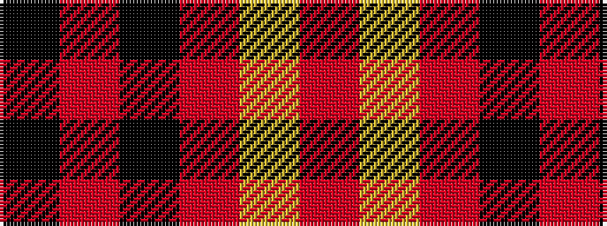

KRKRYR

It is a 6 stripe tartan.

<figure class="pat-woven">

<figcaption>idealised sample</figcaption>
</figure>

## Colour Sequence



## Tartans with this colour sequence

| Tartans |
|---------------|
| [Ailsa, Navy (Fashion)](/setts/s6/k60r3k5r3lr18o3~x2/)|
||
| [Swanstrom (Personal)](/setts/s6/k8r1k8r11ly1r1~x4/)|
||
