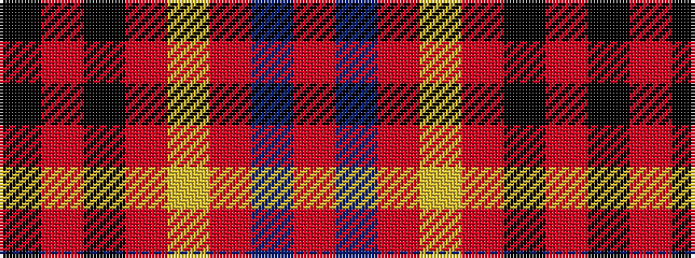

KRKRYRBR

It is a 8 stripe tartan.

<figure class="pat-woven">

<figcaption>idealised sample</figcaption>
</figure>

## Colour Sequence



## Tartans with this colour sequence

| Tartans |
|---------------|
| [Private SA Club](/setts/s8/k3r8k3r8lo19r7dt36r3~x2/)|
||
