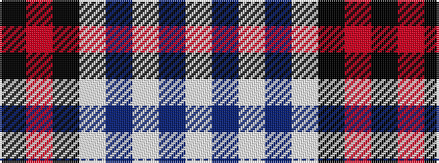

KRKWBWBW

It is a 8 stripe tartan.

<figure class="pat-woven">

<figcaption>idealised sample</figcaption>
</figure>

## Colour Sequence



## Tartans with this colour sequence

| Tartans |
|---------------|
| [Immanuel Presbyterian Church (Milwaukee)](/setts/s8/k3r2k14lt2db6lt2db16lt3~x2/)|
||
