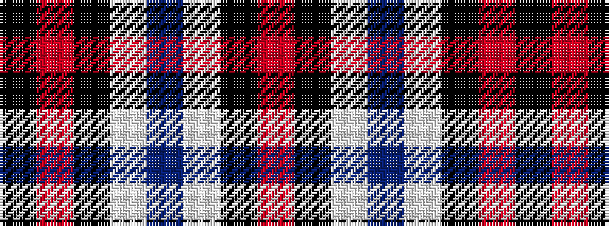

KRKWBWKR

It is a 8 stripe tartan.

<figure class="pat-woven">

<figcaption>idealised sample</figcaption>
</figure>

## Colour Sequence



## Tartans with this colour sequence

| Tartans |
|---------------|
| [State University of New York College at Buffalo](/variants/s8/k70r5k3lb4dp4lb4k3r12/)|
||
