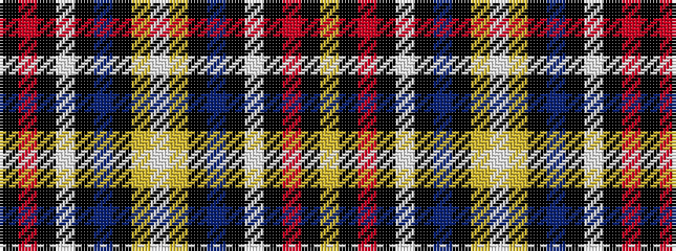

KRKWKBKYWYKBKWKRKY

It is a 18 stripe tartan.

<figure class="pat-woven">

<figcaption>idealised sample</figcaption>
</figure>

## Colour Sequence



## Tartans with this colour sequence

| Tartans |
|---------------|
| [Svanholm (Personal)](/setts/s18/ly4k1m14k1w2k1dp28k4ly2w3~x2/)|
||
