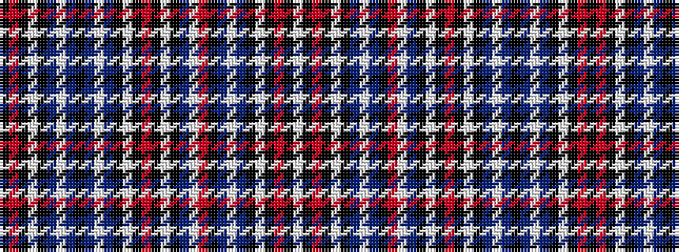

KRKWKBWBKBWBKWKRKWKBWRKBWBKWKRKW

It is a 32 stripe tartan.

<figure class="pat-woven">

<figcaption>idealised sample</figcaption>
</figure>

## Colour Sequence



## Tartans with this colour sequence

| Tartans |
|---------------|
| [McLosek (Personal)](/setts/s32/w8k1m2k1w2k8dp8lb2dp1k2mi1lb2dp8k8w8k2m1k2w8k8dp8lb1dp2k1dp2lb1dp8k8w2k2m1k2/)|
||
