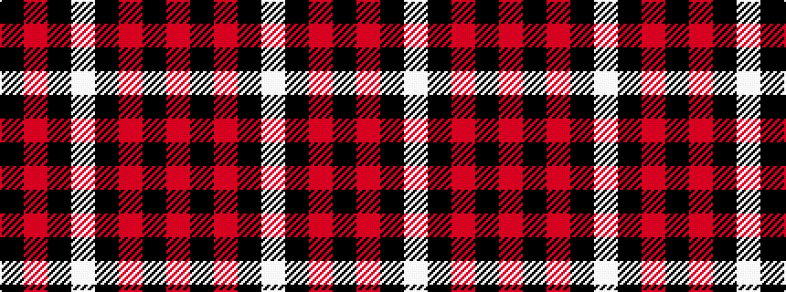

KRKWKRKR

It is a 8 stripe tartan.

<figure class="pat-woven">

<figcaption>idealised sample</figcaption>
</figure>

## Colour Sequence



## Tartans with this colour sequence

| Tartans |
|---------------|
| [bodog.com Corporate Tartan](/variants/s8/k25r25k10lb3k10r25k25r3~x2/)|
||
