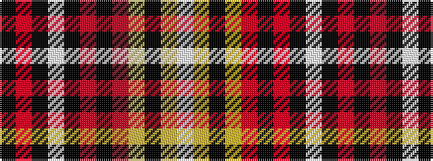

KRKWKRKRYKYW

It is a 12 stripe tartan.

<figure class="pat-woven">

<figcaption>idealised sample</figcaption>
</figure>

## Colour Sequence



## Tartans with this colour sequence

| Tartans |
|---------------|
| [Langtree Trade Tartan Tartan Number: 1131. Earliest known date: pre 2003 A Stewart colour variation marketed by Selfridge's, London and apparently designed and woven by Pendleton Woolen Mills of Oregon. See products available Copyright © Blair Urquhart, Comrie, 2015](/setts/s12/k86o6k4w3k3r3k3o22lo14k3lo6w4/)|
||
