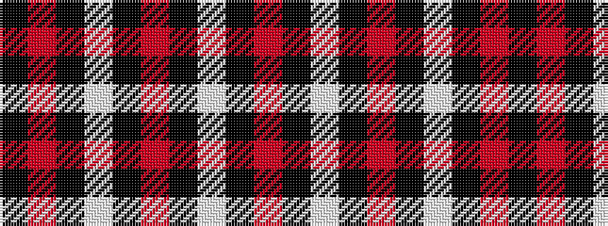

KRKWKRKWKR

It is a 10 stripe tartan.

<figure class="pat-woven">

<figcaption>idealised sample</figcaption>
</figure>

## Colour Sequence



## Tartans with this colour sequence

| Tartans |
|---------------|
| [Buckleigh Dress (Fashion)](/variants/s10/k3r1k1w20k10r2k2w2k2r2~x4/)|
||
