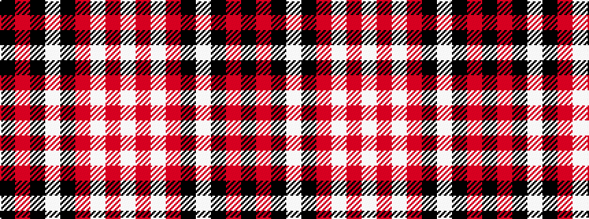

KRKWKRWRW

It is a 9 stripe tartan.

<figure class="pat-woven">

<figcaption>idealised sample</figcaption>
</figure>

## Colour Sequence



## Tartans with this colour sequence

| Tartans |
|---------------|
| [Southern Illinois University (Corp.)](/variants/s9/k5r40k4w2k4r10w4r5w1~x2/)|
||
