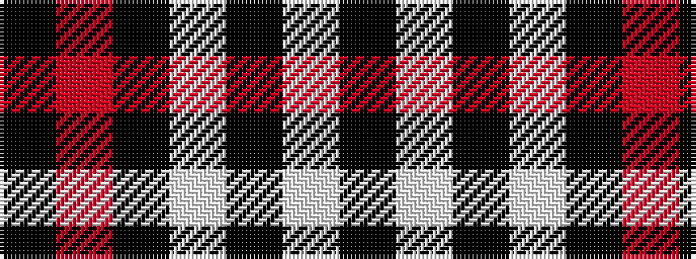

KRKWKWK

It is a 7 stripe tartan.

<figure class="pat-woven">

<figcaption>idealised sample</figcaption>
</figure>

## Colour Sequence



## Tartans with this colour sequence

| Tartans |
|---------------|
| [Lundy Reform](/setts/s7/k2lb5k1lb1k10r1k1~x4/)|
||
