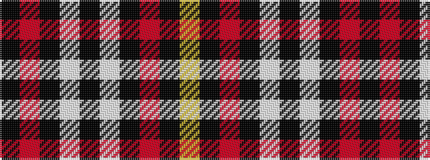

KRKWKWKRKY

It is a 10 stripe tartan.

<figure class="pat-woven">

<figcaption>idealised sample</figcaption>
</figure>

## Colour Sequence



## Tartans with this colour sequence

| Tartans |
|---------------|
| [Ambassador](/variants/s10/k85r6k1w3k3w3k1r6k6lo1~x2/)|
||
