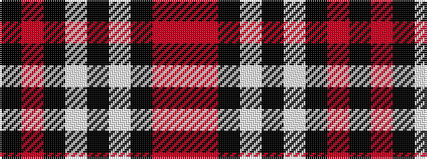

KRKWKWKRR

It is a 9 stripe tartan.

<figure class="pat-woven">

<figcaption>idealised sample</figcaption>
</figure>

## Colour Sequence



## Tartans with this colour sequence

| Tartans |
|---------------|
| [Southdown](/variants/s9/k8r1k3w5k5w3k5o23r3~x2/)|
||
