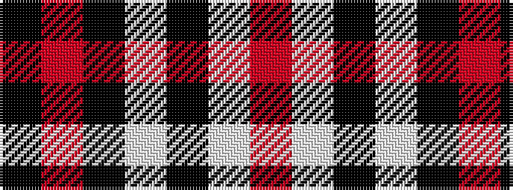

KRKWKWR

It is a 7 stripe tartan.

<figure class="pat-woven">

<figcaption>idealised sample</figcaption>
</figure>

## Colour Sequence



## Tartans with this colour sequence

| Tartans |
|---------------|
| [Rocket Dog (Fashion)](/variants/s7/k9r9k25w30k5w5r7/)|
||
