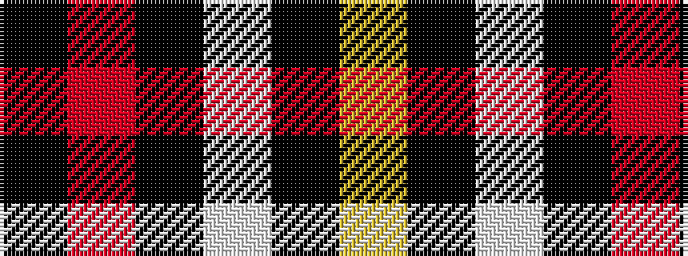

KRKWKY

It is a 6 stripe tartan.

<figure class="pat-woven">

<figcaption>idealised sample</figcaption>
</figure>

## Colour Sequence



## Tartans with this colour sequence

| Tartans |
|---------------|
| [Black (symmetrical)](/setts/s6/k17r6k2lb6k17lo2~x2/)|
||
| [Black 1990 (Name)](/setts/s6/k17r6k2w6k17lo2~x2/)|
||
| [Davet (2014)](/setts/s6/lg5k1w11k1r42k1~x2/)|
||
| [Dunbar #2](/setts/s6/k4r26k4w2k13ly4~x2/)|
||
| [Dunbar (District)](/setts/s6/k8r49k8lb3k20lo3~x2/)|
||
