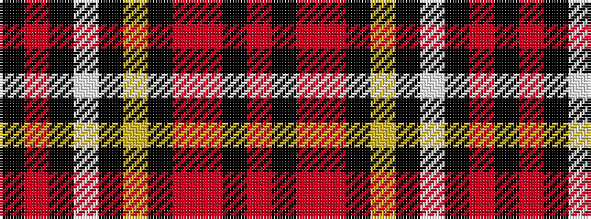

KRKWKYKRRKR

It is a 11 stripe tartan.

<figure class="pat-woven">

<figcaption>idealised sample</figcaption>
</figure>

## Colour Sequence



## Tartans with this colour sequence

| Tartans |
|---------------|
| [Field Marshall Montgomery PB (Corp)](/setts/s11/k8r1k31w2k8ly1k2r1r10k6r2~x2/)|
||
