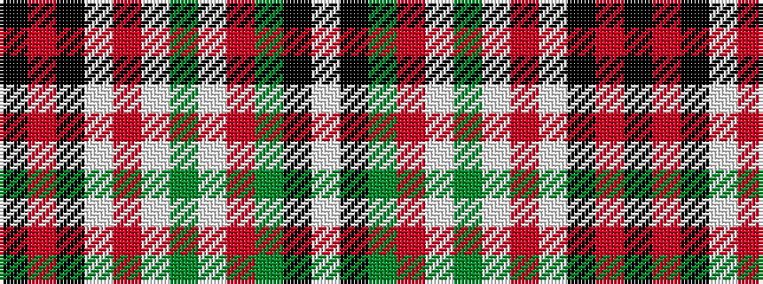

KRKWRWGWRGKW

It is a 12 stripe tartan.

<figure class="pat-woven">

<figcaption>idealised sample</figcaption>
</figure>

## Colour Sequence



## Tartans with this colour sequence

| Tartans |
|---------------|
| [Glenfalloch](/variants/s12/k4r1k12w1r4w1dg4w1m4dg12k1w2~x2/)|
||
