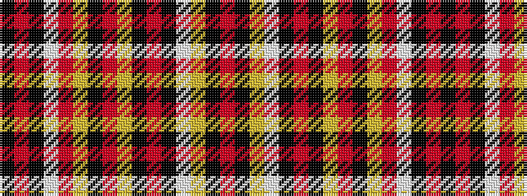

KRKWRYKRYKRKWYKR

It is a 16 stripe tartan.

<figure class="pat-woven">

<figcaption>idealised sample</figcaption>
</figure>

## Colour Sequence



## Tartans with this colour sequence

| Tartans |
|---------------|
| [Northern Guard Supporters](/variants/s16/k8m3k1w2o1lo1k25o2lo2k3m5k1w3lo7k1o1~x2/)|
||
