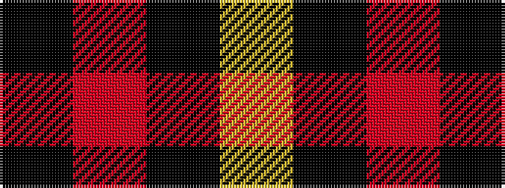

KRKY

It is a 4 stripe tartan.

<figure class="pat-woven">

<figcaption>idealised sample</figcaption>
</figure>

## Colour Sequence



## Tartans with this colour sequence

| Tartans |
|---------------|
| [Masai Shuka 26 (Artefact)](/setts/s4/ly3k2r10k1~x4/)|
||
| [Wallace](/setts/s4/k1r8k8ly1~x6/)|
||
| [Wallace](/setts/s4/k1r8k8ly1/)|
||
| [Wallace](/setts/s4/k1r8k8ly1~x2/)|
||
| [Wallace (Clan)](/setts/s4/k1r8k8ly1~x4/)|
||
