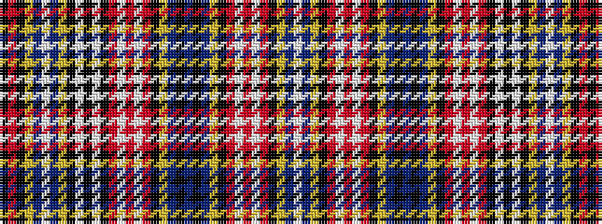

KRKYBWBYKWKWKRWRWRKYBKBKBYKRWRWRKYBW

It is a 36 stripe tartan.

<figure class="pat-woven">

<figcaption>idealised sample</figcaption>
</figure>

## Colour Sequence



## Tartans with this colour sequence

| Tartans |
|---------------|
| [Ogilvy or Drummond of Strathallen](/setts/s36/k6r6k6ly5db5w5db5ly5k9w1k4w1k9r5w5r5w5r5k5ly5db12k4db10k4db12ly4k5r4w4r4w4r4k4ly4db4w4~x2/)|
||
