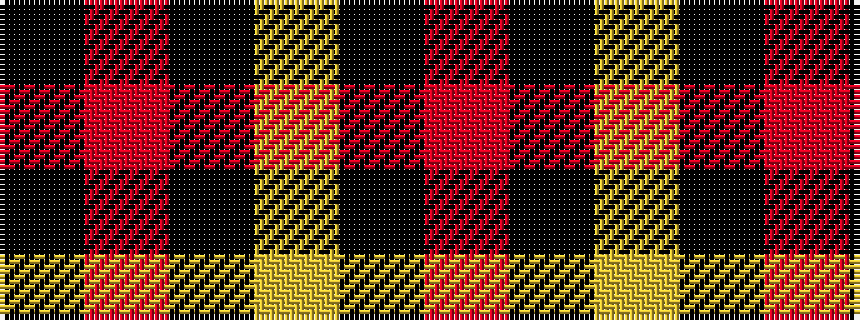

KRKYKR

It is a 6 stripe tartan.

<figure class="pat-woven">

<figcaption>idealised sample</figcaption>
</figure>

## Colour Sequence



## Tartans with this colour sequence

| Tartans |
|---------------|
| [Brodie](/setts/s6/k2r16k8ly1k8r2~x2/)|
||
| [Brodie (Clan)](/setts/s6/k3r15k11ly2k4r3~x2/)|
||
| [Brodie (Clan)](/setts/s6/k2r16k8ly1k8r2~x4/)|
||
| [Brodie Dress](/setts/s6/k2r16k8ly1k8r2/)|
||
