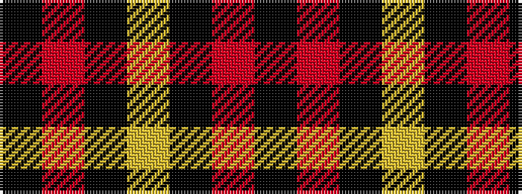

KRKYKRK

It is a 7 stripe tartan.

<figure class="pat-woven">

<figcaption>idealised sample</figcaption>
</figure>

## Colour Sequence



## Tartans with this colour sequence

| Tartans |
|---------------|
| [Punky Princess](/setts/s7/k14m2k4lr3k12m8k1~x2/)|
||
