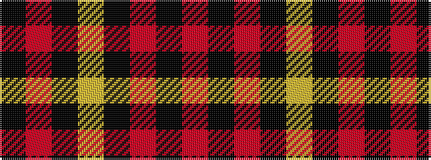

KRKYKRKR

It is a 8 stripe tartan.

<figure class="pat-woven">

<figcaption>idealised sample</figcaption>
</figure>

## Colour Sequence



## Tartans with this colour sequence

| Tartans |
|---------------|
| [Auld Bernensis](/variants/s8/k62r3k3lo3k3r3k9o5~x2/)|
||
| [Haig & Haig Whisky](/variants/s8/r26k18r7k4ly4~x2/)|
||
