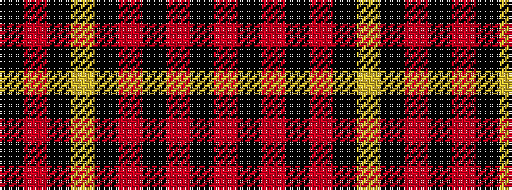

KRKYKRKRKR

It is a 10 stripe tartan.

<figure class="pat-woven">

<figcaption>idealised sample</figcaption>
</figure>

## Colour Sequence



## Tartans with this colour sequence

| Tartans |
|---------------|
| [Tyndrum](/setts/s10/o6k1o1k1o2k4lo6k1o2k2~x8/)|
||
