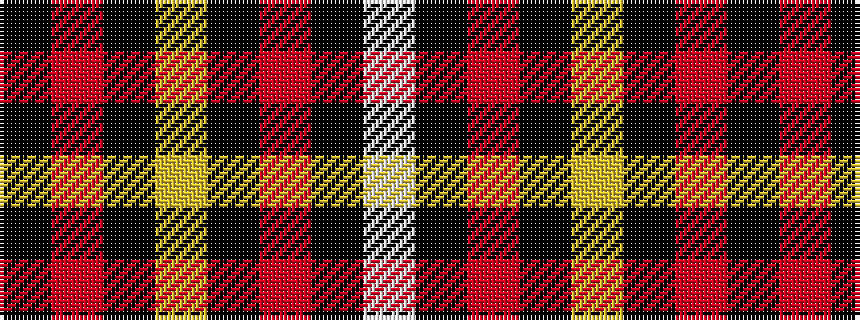

KRKYKRKW

It is a 8 stripe tartan.

<figure class="pat-woven">

<figcaption>idealised sample</figcaption>
</figure>

## Colour Sequence



## Tartans with this colour sequence

| Tartans |
|---------------|
| [Black Country (District)](/setts/s8/k21r1k1ly1k1r1k3w3~x6/)|
||
