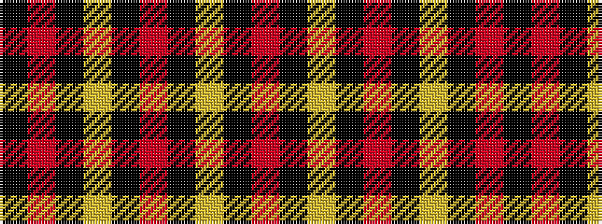

KRKYKRKYKR

It is a 10 stripe tartan.

<figure class="pat-woven">

<figcaption>idealised sample</figcaption>
</figure>

## Colour Sequence



## Tartans with this colour sequence

| Tartans |
|---------------|
| [Burke (Kennesaw), Kevin](/variants/s10/k62r23k1ly5k1r3k1ly2k1r8~x2/)|
||
| [Burke (Name)](/variants/s10/k62r23k1lo5k1r3k1lo2k1r8~x2/)|
||
