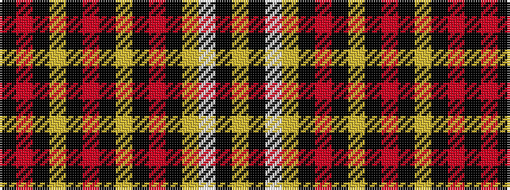

KRKYKRKYKRKYWKY

It is a 15 stripe tartan.

<figure class="pat-woven">

<figcaption>idealised sample</figcaption>
</figure>

## Colour Sequence



## Tartans with this colour sequence

| Tartans |
|---------------|
| [Black Onyx (Fashion)](/variants/s15/k30o33k1lo1k1o8k1lo2k1o3k1lo3w2k1lo7~x2/)|
||
