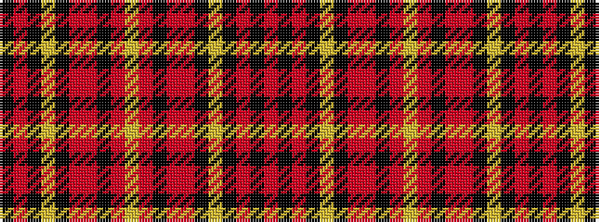

KRKYKRRKRYRKRRKYKRKR

It is a 20 stripe tartan.

<figure class="pat-woven">

<figcaption>idealised sample</figcaption>
</figure>

## Colour Sequence



## Tartans with this colour sequence

| Tartans |
|---------------|
| [Islay](/setts/s20/o40k10o2k2lr2k3r8o6k2o8lr2~x2/)|
||
