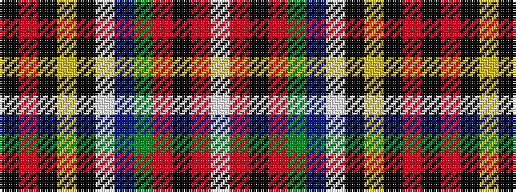

KRKYKWBGRKRW

It is a 12 stripe tartan.

<figure class="pat-woven">

<figcaption>idealised sample</figcaption>
</figure>

## Colour Sequence



## Tartans with this colour sequence

| Tartans |
|---------------|
| [Stewart of Galloway](/setts/s12/k3r24k4ly1k2w1db4g6r3k1r2w1~x2/)|
||
| [Stewart of Galloway - 1842 (Clan)](/setts/s12/k3r24k4ly1k2w1db4dg6r3k1r2w1~x4/)|
||
