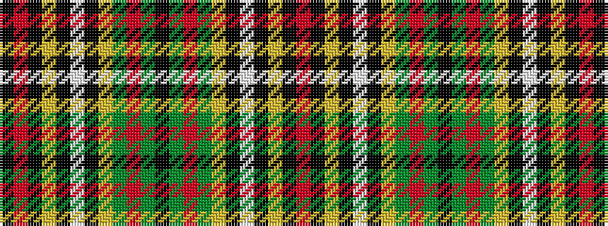

KRKYKWKYGRGKGRGYKWKYKR

It is a 22 stripe tartan.

<figure class="pat-woven">

<figcaption>idealised sample</figcaption>
</figure>

## Colour Sequence



## Tartans with this colour sequence

| Tartans |
|---------------|
| [O'Keefe](/setts/s22/k8r2k3ly2k2w3k2lo12y22r2y2k1~x2/)|
||
