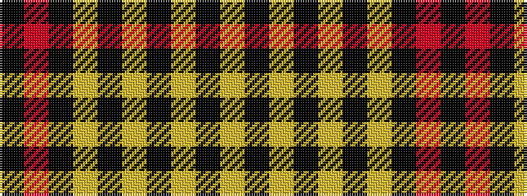

KRKYKYKYKY

It is a 10 stripe tartan.

<figure class="pat-woven">

<figcaption>idealised sample</figcaption>
</figure>

## Colour Sequence



## Tartans with this colour sequence

| Tartans |
|---------------|
| [Ulster Irish District Tartan](/variants/s10/ly28k2ly28k2ly2k2lo29k2r2k2~x2/)|
||
