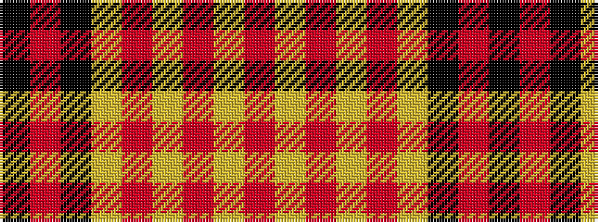

KRKYRYRYR

It is a 9 stripe tartan.

<figure class="pat-woven">

<figcaption>idealised sample</figcaption>
</figure>

## Colour Sequence



## Tartans with this colour sequence

| Tartans |
|---------------|
| [Brecheen](/setts/s9/k3r1k14lo14r1lo1r1lo1r2~x4/)|
||
| [Brecheen (Name)](/setts/s9/k3r1k14ly14r1ly1r1ly1r2~x4/)|
||
