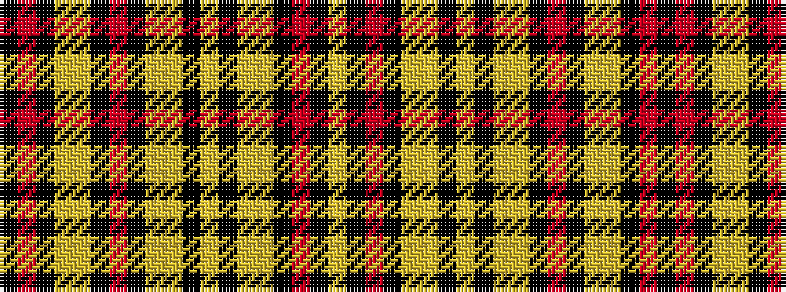

KRKYYKRKYYKYKYYKRKY

It is a 19 stripe tartan.

<figure class="pat-woven">

<figcaption>idealised sample</figcaption>
</figure>

## Colour Sequence



## Tartans with this colour sequence

| Tartans |
|---------------|
| [Stevens #6](/variants/s19/k3r3k14lo2ly2k3r13k3lo2ly2k4lo6k3ly2lo2k14r3k3ly3~x2/)|
||
