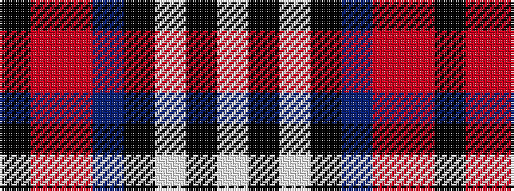

KRRBKWKW

It is a 8 stripe tartan.

<figure class="pat-woven">

<figcaption>idealised sample</figcaption>
</figure>

## Colour Sequence



## Tartans with this colour sequence

| Tartans |
|---------------|
| [Lootens Jensen (Personal)](/variants/s8/w26k8w3k5db3r5o3k4~x2/)|
||
