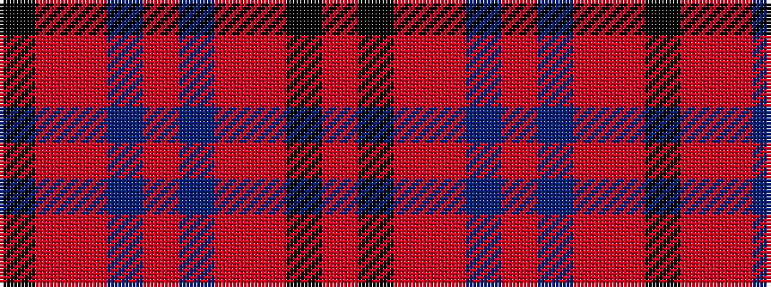

KRRBRBRRKR

It is a 10 stripe tartan.

<figure class="pat-woven">

<figcaption>idealised sample</figcaption>
</figure>

## Colour Sequence



## Tartans with this colour sequence

| Tartans |
|---------------|
| [Grelloch](/setts/s10/r2k1r12r12t1m2~x4/)|
||
