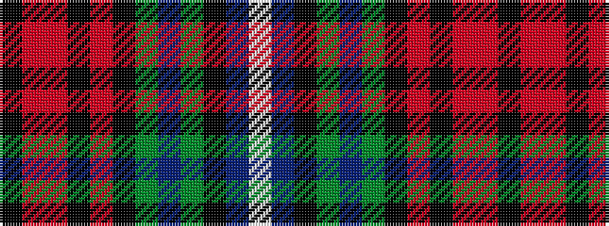

KRRKRKGBGKBW

It is a 12 stripe tartan.

<figure class="pat-woven">

<figcaption>idealised sample</figcaption>
</figure>

## Colour Sequence



## Tartans with this colour sequence

| Tartans |
|---------------|
| [MacMunn](/variants/s12/k4r8o4k2o4k40g5dp4g5k2b2w4~x2/)|
||
