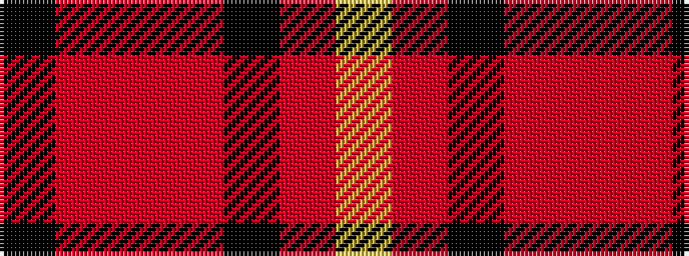

KRRRKRY

It is a 7 stripe tartan.

<figure class="pat-woven">

<figcaption>idealised sample</figcaption>
</figure>

## Colour Sequence



## Tartans with this colour sequence

| Tartans |
|---------------|
| [Welsh, National](/variants/s7/k4o2r2o2k2o15ly2~x4/)|
||
