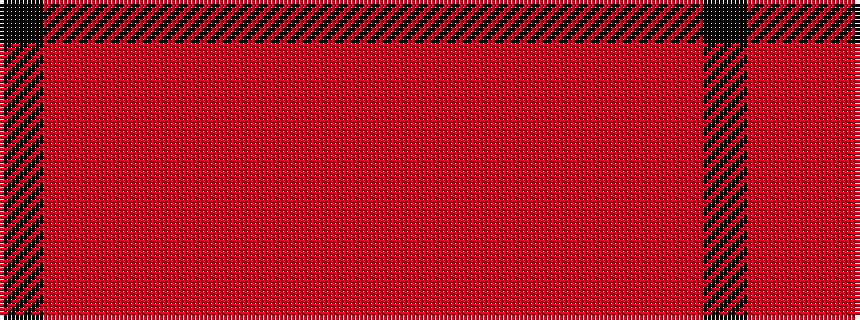

KRRRRRRRR

It is a 9 stripe tartan.

<figure class="pat-woven">

<figcaption>idealised sample</figcaption>
</figure>

## Colour Sequence



## Tartans with this colour sequence

| Tartans |
|---------------|
| [Tune Hotels Corporate Tartan](/variants/s9/r3ri18rii6r15ri4r3ri4r7k2~x2/)|
||
