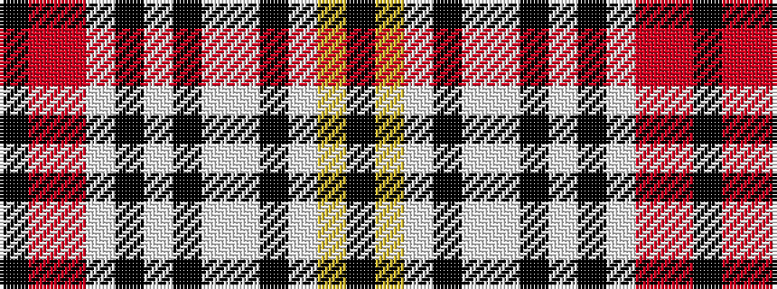

KRRWKWKWWKWYK

It is a 13 stripe tartan.

<figure class="pat-woven">

<figcaption>idealised sample</figcaption>
</figure>

## Colour Sequence



## Tartans with this colour sequence

| Tartans |
|---------------|
| [Un-named (USA Bedheads)](/setts/s13/k4lg9lb30k2lb4w5k2w2k1w2r7r15k3~x2/)|
||
