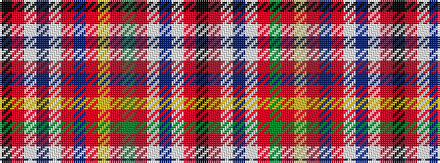

KRWBWRBRYRGRWBWRK

It is a 17 stripe tartan.

<figure class="pat-woven">

<figcaption>idealised sample</figcaption>
</figure>

## Colour Sequence



## Tartans with this colour sequence

| Tartans |
|---------------|
| [Haughdale](/setts/s17/k2r12lb2dp6lb2r3db12r4ly2r4g12r3lb2dp6lb2r12k2~x2/)|
||
