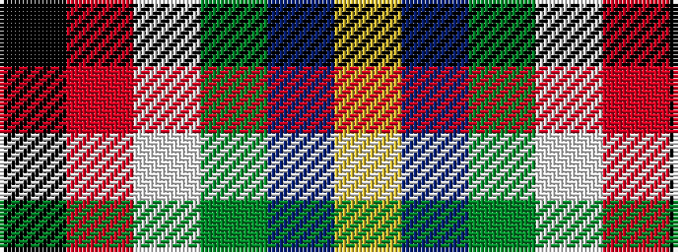

KRWGBY

It is a 6 stripe tartan.

<figure class="pat-woven">

<figcaption>idealised sample</figcaption>
</figure>

## Colour Sequence



## Tartans with this colour sequence

| Tartans |
|---------------|
| [Reekie (Edmonton)](/variants/s6/k8r12w8dg15n30ly5~x2/)|
||
| [Reekie (Name)](/variants/s6/k8r12w8g15db30ly5~x2/)|
||
