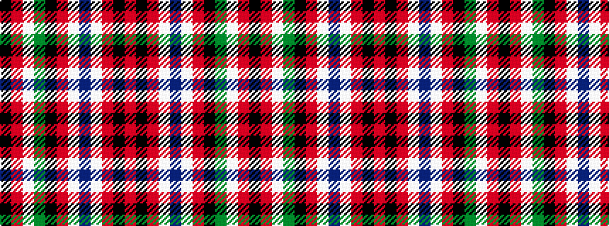

KRWGKRWBWRKR

It is a 12 stripe tartan.

<figure class="pat-woven">

<figcaption>idealised sample</figcaption>
</figure>

## Colour Sequence



## Tartans with this colour sequence

| Tartans |
|---------------|
| [Trevison](/variants/s12/r47k1r6w3dt2w3r6k13g2w2r2k13~x2/)|
||
