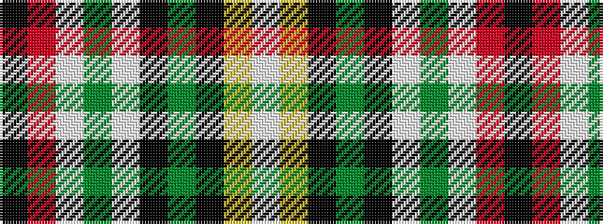

KRWGWKGKYW

It is a 10 stripe tartan.

<figure class="pat-woven">

<figcaption>idealised sample</figcaption>
</figure>

## Colour Sequence



## Tartans with this colour sequence

| Tartans |
|---------------|
| [Kingsbarns Golf Links (Corporate)](/setts/s10/k2r1lt1g1lt12k12g1k1ly1lt2~x4/)|
||
